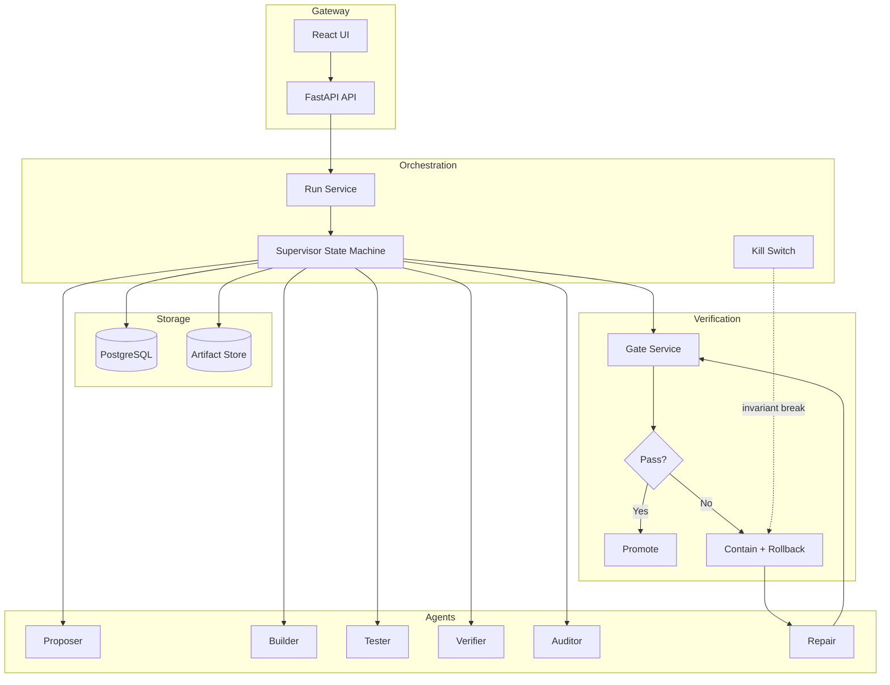

# IRONROOT

> **Irreversible Research Ecology for Robust Agent Evolution**

<div align="center">


**140 tests passing** · **51%+ coverage** · **Strict quality gates**

</div>

---

## What This Is

A system for running AI agents that must prove their work is correct before they can evolve.

Agents run in supervised loops. They propose changes, build implementations, write tests, and verify each other's work. Memory is write-once - you can add new records but never edit old ones. Every file is stored by its content hash, so tampering is obvious. Agents that fail lose resources permanently. There are no resets.

When something breaks, the system stops accepting changes, rolls back to the last good state, runs a repair process, and adds a new test to prevent it from happening again.

When agents evolve, they do so through explicit versioned strategies that must pass all verification gates before promotion. No hidden prompt changes, no silent drift.

**This is not a chatbot.** It is a research platform for building agents that improve through hard evidence and adversarial testing.

---

## 📐 Architecture



---

## 🔑 Core Rules

| Rule | How It Works | Code |
|------|--------------|------|
| **Memory is write-once** | You can add beliefs but never edit or delete them. Hash chains verify nothing was tampered with. | [`append_only_store.py`](src/ironroot/cognition/memory/append_only_store.py) |
| **Files are stored by content hash** | Same content = same path. If you change one byte, the hash changes. Tampering is obvious. | [`artifacts.py`](src/ironroot/storage/artifacts.py) |
| **Budgets are enforced** | Agents have limited steps, tool calls, and memory writes. When they run out, they stop. No exceptions. | [`budgets.py`](src/ironroot/orchestration/budgets.py) |
| **Promotion requires passing tests** | A strategy cannot be promoted unless all verification gates pass first. | [`strategy_service.py`](src/ironroot/cognition/strategies/strategy_service.py) |
| **Failures trigger containment** | When something breaks, the system freezes changes and starts recovery. | [`kill_switch.py`](src/ironroot/orchestration/kill_switch.py) |

---

## 📦 Module Map

<details>
<summary><strong>🎛️ Orchestration</strong> — Run lifecycle, budgets, self-healing</summary>

| Module | Purpose |
|--------|---------|
| [`supervisor.py`](src/ironroot/orchestration/supervisor.py) | State machine: init → propose → build → test → verify → audit → decide |
| [`budgets.py`](src/ironroot/orchestration/budgets.py) | Hard limits on steps, tool calls, memory writes |
| [`kill_switch.py`](src/ironroot/orchestration/kill_switch.py) | Invariant break triggers containment |
| [`run_service.py`](src/ironroot/orchestration/run_service.py) | CRUD for runs with budget tracking |
| [`healing.py`](src/ironroot/orchestration/healing.py) | Containment → rollback → repair → retest flow |
| [`incidents.py`](src/ironroot/orchestration/incidents.py) | Incident types and severity mapping |

</details>

<details>
<summary><strong>💾 Storage</strong> — Content-addressed artifacts, models</summary>

| Module | Purpose |
|--------|---------|
| [`artifacts.py`](src/ironroot/storage/artifacts.py) | SHA256 hashing, write-once enforcement |
| [`artifact_service.py`](src/ironroot/storage/artifact_service.py) | Store/retrieve with integrity verification |
| [`models.py`](src/ironroot/storage/models.py) | SQLAlchemy ORM: runs, beliefs, agents, incidents, gates, strategies |
| [`postgres.py`](src/ironroot/storage/postgres.py) | Session factory and base model |

</details>

<details>
<summary><strong>🧠 Cognition</strong> — Beliefs, strategies, memory</summary>

| Module | Purpose |
|--------|---------|
| [`append_only_store.py`](src/ironroot/cognition/memory/append_only_store.py) | Immutable belief records with hash chain |
| [`belief_service.py`](src/ironroot/cognition/memory/belief_service.py) | DB persistence, chain verification |
| [`contradiction.py`](src/ironroot/cognition/memory/contradiction.py) | Links conflicting beliefs as new events |
| [`mutation.py`](src/ironroot/cognition/strategies/mutation.py) | Bounded strategy changes with provenance |
| [`strategy_service.py`](src/ironroot/cognition/strategies/strategy_service.py) | Gate-blocked promotion, multi-objective scoring |
| [`registry.py`](src/ironroot/cognition/strategies/registry.py) | In-memory strategy version management |

</details>

<details>
<summary><strong>✅ Verification</strong> — Gates, replay, integrity</summary>

| Module | Purpose |
|--------|---------|
| [`gate_service.py`](src/ironroot/verification/gate_service.py) | Executes replay, integrity, invariant, regression gates |
| [`replay.py`](src/ironroot/verification/replay.py) | Same inputs + seed = equivalent trace digest |
| [`regression_gate.py`](src/ironroot/verification/regression_gate.py) | All gates must pass for promotion |
| [`integrity.py`](src/ironroot/verification/integrity.py) | Stored bytes hash equals recorded hash |

</details>

<details>
<summary><strong>🤖 Agents</strong> — Specialized workers with budgets</summary>

| Agent | Scope |
|-------|-------|
| [`base.py`](src/ironroot/agents/base.py) | Budgets, penalties, tool access |
| [`proposer.py`](src/ironroot/agents/proposer.py) | Proposes cognitive layer changes |
| [`builder.py`](src/ironroot/agents/builder.py) | Implements under stable contracts |
| [`tester.py`](src/ironroot/agents/tester.py) | Writes tests against claims |
| [`verifier.py`](src/ironroot/agents/verifier.py) | Attempts falsification |
| [`auditor.py`](src/ironroot/agents/auditor.py) | Trace integrity, policy compliance |
| [`repair.py`](src/ironroot/agents/repair.py) | Minimal diff + mandatory new test |

</details>

---

## 🚀 Quick Start

```bash
# Clone
git clone https://github.com/moonrunnerkc/ironroot.git && cd ironroot

# Python 3.12+ virtual environment
python3.12 -m venv .venv && source .venv/bin/activate

# Install with dev dependencies
pip install -e ".[dev]"

# Environment config
cp .env.example .env

# Start infrastructure (postgres + redis)
./scripts/dev_up.sh

# Create database tables
python -c "
from ironroot.storage.postgres import get_engine, Base
from ironroot.storage.models import *
import asyncio
asyncio.run((lambda: (async_setup := (lambda e: e.begin().__aenter__().then(lambda c: c.run_sync(Base.metadata.create_all)))))(get_engine()))
" 2>/dev/null || python -c "
from ironroot.storage.postgres import get_engine, Base
from ironroot.storage.models import *
import asyncio
async def setup():
    async with get_engine().begin() as conn:
        await conn.run_sync(Base.metadata.create_all)
asyncio.run(setup())
"

# Verify: 140 tests, 50%+ coverage
pytest -q --cov=src/ironroot --cov-fail-under=50

# Start API server (Terminal 1)
./scripts/run_once.sh

# Start UI (Terminal 2)
cd ui && npm install && npm run dev
```

### Access Points

| Service | URL | Description |
|---------|-----|-------------|
| **Research Console** | http://localhost:3000 | Main researcher interface |
| **API Docs** | http://localhost:8000/docs | OpenAPI/Swagger documentation |
| **Health Check** | http://localhost:8000/api/v1/health | System status |

---

## 🔬 Research Console

The main UI for researchers to submit research criteria and view results.


**Features:**
- Natural language research input
- Real-time progress tracking with ETA
- Plain English results summary
- Verifiable evidence with content hashes
- Downloadable full reports

**Workflow:**
1. Enter research criteria in plain English
2. Click "Submit Research"
3. Watch progress as the system generates questions, forms hypotheses, gathers data
4. View results with key findings and supporting evidence

---

## 🔌 API Reference

Base: `/api/v1`

| Endpoint | Method | Purpose |
|:---------|:------:|:--------|
| `/health` | `GET` | DB, queue, store connectivity |
| `/runs` | `POST` | Create run with seed, budgets, gates |
| `/runs/{id}` | `GET` | Status, phase, budgets, failures |
| `/runs/{id}/start` | `POST` | Start orchestration |
| `/runs/{id}/stop` | `POST` | Hard stop, freeze commits |
| `/runs/{id}/gates/execute` | `POST` | Execute gate suite |
| `/runs/{id}/gates/status` | `GET` | Pass/fail with artifact evidence |
| `/artifacts/{id}` | `GET` | Metadata + download |
| `/beliefs` | `GET` | List with filters |
| `/beliefs/{id}/contradictions` | `GET` | Linked contradiction events |
| `/strategies` | `GET` `POST` | List or register |
| `/strategies/{id}/promote` | `POST` | Promote if gate passed |

---

## 🧪 Testing

```bash
pytest tests/unit -v              # Unit tests
pytest tests/integration -v       # Requires postgres/redis
pytest tests/e2e -v               # Full research cycle
pytest --cov=src/ironroot         # Coverage report
```

---

## ❓ Skeptic's Corner

<details>
<summary><strong>Why write-once memory?</strong></summary>

If agents can edit their past beliefs, you lose the ability to see what they actually thought and when. The [`append_only_store.py`](src/ironroot/cognition/memory/append_only_store.py) prevents any updates or deletes. When an agent changes its mind, that's recorded as a new belief linked to the old one. The hash chain means if anyone tampers with history, the math breaks and you'll know.

</details>

<details>
<summary><strong>Why store files by hash?</strong></summary>

If you use random IDs, you're trusting that the database correctly tracks what's what. If you use content hashes, the file's identity is its content - same bytes always means same hash. The [`artifacts.py`](src/ironroot/storage/artifacts.py) module stores everything by its SHA256 hash. Change one byte, the hash changes, the path changes. You can't silently modify a file.

</details>

<details>
<summary><strong>Why use explicit state machines?</strong></summary>

When code "just runs" without clear phases, it's hard to know where things went wrong. The [`supervisor.py`](src/ironroot/orchestration/supervisor.py) defines every step: init, propose, build, test, verify, audit, decide. Each transition has rules. The kill switch can stop execution at any point. If you replay with the same inputs, you get the same path through the machine.

</details>

<details>
<summary><strong>Why have separate verifiers?</strong></summary>

Agents shouldn't grade their own work - that's a conflict of interest. The [`verifier.py`](src/ironroot/agents/verifier.py) exists specifically to try to break proposals. The [`auditor.py`](src/ironroot/agents/auditor.py) checks that the execution trace is intact. Neither one benefits from saying "yes" to bad work. The [`regression_gate.py`](src/ironroot/verification/regression_gate.py) ensures nothing gets promoted without passing these adversarial checks.

</details>

<details>
<summary><strong>Why permanent penalties?</strong></summary>

If agents can just retry after failing, they learn that failure is cheap. The [`budgets.py`](src/ironroot/orchestration/budgets.py) tracks lifetime limits - steps, tool calls, memory writes. Fail a verification? You lose budget permanently. Get a tool revoked? It stays revoked. This pressure selects for agents that are careful and calibrated. Reckless agents run out of resources and stop.

</details>

---

## 🔬 Reality Interface Layer (RIL)

The gate between IRONROOT and external truth. This allows beliefs to be wrong because of reality, not because of logic or simulation.

### What It Does

1. **External Reality Sources**: Connects to real external data (UCI Wine Quality dataset with hidden holdout)
2. **Prediction Locking**: Agents commit to predictions BEFORE seeing reality data
3. **Automatic Contradiction**: Math compares predictions vs observations - no agent discretion
4. **Penalty Application**: Wrong predictions incur penalties proportional to error magnitude
5. **Cross-Run Survival**: Track which predictions survive repeated falsification

### API Endpoints

```bash
# Run prediction-locked falsification test
POST /api/v1/reality/falsification
{
  "source_seed": 42,
  "predictions": [
    {"metric_name": "mean_quality", "lower": 5.4, "upper": 5.8, "rationale": "..."},
    {"metric_name": "std_quality", "lower": 0.7, "upper": 1.0, "rationale": "..."}
  ]
}

# Get detailed results
GET /api/v1/reality/falsification/{run_id}

# Get cross-run survival stats
GET /api/v1/reality/survival/{source_id}
```

### Example: Prediction vs Reality

| Metric | Predicted Range | Observed | Confirmed | Penalty |
|--------|-----------------|----------|-----------|---------|
| mean_quality | [5.40, 5.80] | 5.7147 | ✅ | 0.00 |
| std_quality | [0.70, 1.00] | 0.8146 | ✅ | 0.00 |
| correlation_alcohol_quality | [0.30, 0.60] | 0.4077 | ✅ | 0.00 |
| high_quality_fraction | [0.10, 0.25] | 0.1661 | ✅ | 0.00 |

### Provenance Proof

```json
{
  "source_type": "dataset_holdout",
  "acquisition_method": "HTTP GET from UCI ML Repository + holdout split",
  "data_hash": "4a402cf041b025d4566d954c3b9ba8635a3a8a01e039005d97d6a710278cf05e"
}
```

This proves predictions were locked before reality was observed, and reality came from an external source that could not be influenced by agents.

---

## 🧱 Capability Layers

Five infrastructure layers for testing agent capabilities against external evidence. No claims of intelligence - just measurable, falsifiable behaviors.

### Layer 1: Multi-Domain Reality Sources

Nine reality sources spanning different data types:

| Source Type | Examples | What Gets Tested |
|-------------|----------|------------------|
| **Tabular** | `tabular_wine`, `tabular_iris` | Holdout predictions on structured data |
| **Time Series** | `timeseries_walk` | Future value forecasting |
| **Simulator** | `simulator_pendulum`, `simulator_spring` | Hidden parameter inference from observations |
| **Delayed** | `delayed_treatment`, `delayed_investment` | Prediction before outcomes are revealed |
| **Adversarial** | `adversarial_shift`, `adversarial_noise` | Robustness to distribution changes |

**Metrics:**
- `cross_domain_survival_rate` — fraction of domains where predictions held
- `distribution_shift_failure_rate` — failures under adversarial conditions
- `calibration_error` — confidence vs actual accuracy gap

```bash
# List available reality domains
GET /api/v1/agi/domains

# Run cross-domain test
POST /api/v1/agi/cross-domain
```

### Layer 2: World Model Registry

First-class storage for causal/counterfactual models. Models are artifacts with provenance tracking.

| Component | Purpose |
|-----------|---------|
| `WorldModelSpec` | Structure, training data hash, version |
| `CounterfactualQuery` | What-if queries with expected outcomes |
| `EvaluationReport` | Accuracy on counterfactual test suite |

**Metrics:**
- `counterfactual_accuracy` — correct answers on what-if queries
- `intervention_success_rate` — do() operations work as expected
- `causal_consistency_score` — model respects causal structure

```bash
# Register a world model
POST /api/v1/agi/world-model

# Query counterfactual
POST /api/v1/agi/world-model/counterfactual
```

### Layer 3: Capability Registry

Structured curriculum of 10 capabilities with explicit test protocols:

| Level | Capabilities |
|-------|--------------|
| **Basic (1)** | Prediction Locking |
| **Intermediate (2)** | Cross-Domain Transfer, Counterfactual Reasoning, Distribution Shift Detection |
| **Advanced (3)** | Calibrated Uncertainty, Planning with Model, Self-Correction |
| **Expert (4)** | Adversarial Robustness, Multi-Step Reasoning |
| **Master (5)** | Continual Learning |

Each capability specifies:
- **Definition**: What exactly is being tested
- **Test Protocol**: How to measure success
- **Failure Modes**: Known ways to fail
- **Evidence Artifacts**: Required proof of capability
- **Promotion Threshold**: Metric value required to pass

**Metrics:**
- `capability_pass_rate_by_level` — pass rate for each difficulty level
- `sample_efficiency` — capabilities passed per sample
- `transfer_gain` — speed improvement on new domains

```bash
# List all capabilities and status
GET /api/v1/agi/capabilities

# Record a capability attempt
POST /api/v1/agi/capabilities/attempt
```

### Layer 4: Strategy Evolution Gate

Strategies evolve only through strict external promotion rules. No self-improvement claims - just verified incremental changes.

**Promotion Rules (all must pass):**
1. All verification gates passed
2. Effect size ≥ 5% improvement on primary metrics
3. No regression > 2% on baseline suite
4. ≥ 80% of adversarial tests passed

**Metrics:**
- `effect_size` — magnitude of improvement
- `statistical_significance` — confidence the improvement is real
- `regression_rate_on_baseline_suite` — degradation on established tests

```bash
# Register baseline metric
POST /api/v1/agi/evolution/baseline?metric_name=accuracy&value=0.8

# Evaluate strategy for promotion
POST /api/v1/agi/evolution/evaluate
```

### Layer 5: Self-Healing Restoration

When invariants break, the system must restore correctness and prevent recurrence.

**Restoration Process:**
1. Detect violation type (hash_chain, budget, phase, replay, artifact, belief)
2. Apply restoration strategy (rollback, recompute, repair)
3. Verify invariants restored
4. Verify replay gate passes
5. Add regression test
6. Check recurrence over 10 runs

**Metrics:**
- `time_to_invariant_restoration_ms` — how fast correctness returns
- `repair_success_rate_over_trials` — reliability of repair
- `recurrence_rate_over_10_runs` — does the problem come back?

```bash
# Report a violation
POST /api/v1/agi/healing/violation

# Attempt restoration
POST /api/v1/agi/healing/restore/{violation_id}
```

### External Task Battery

50 held-out tasks for external evaluation. Tasks are generated from seeds and scored automatically.

| Domain | Task Types |
|--------|------------|
| **Prediction** | Sequence continuation (easy/medium/hard) |
| **Reasoning** | Logical inference from premises |
| **Planning** | Grid navigation, action sequencing |
| **Calibration** | Probability estimation from samples |

**Promotion Threshold:** 50% overall score required

All task inputs and ground truths are hashed. Results include provenance for audit.

```bash
# Run the task battery
POST /api/v1/agi/battery/evaluate
{
  "strategy_id": "my_strategy",
  "seed": 42
}

# Example response:
{
  "tasks_run": 50,
  "tasks_correct": 27,
  "overall_score": 0.62,
  "score_by_domain": {
    "prediction": 0.86,
    "reasoning": 0.0,
    "planning": 1.0,
    "calibration": 0.82
  },
  "meets_promotion_threshold": true
}
```

---

<div align="center">

**MIT License** · Built for researchers, by researchers

</div>

