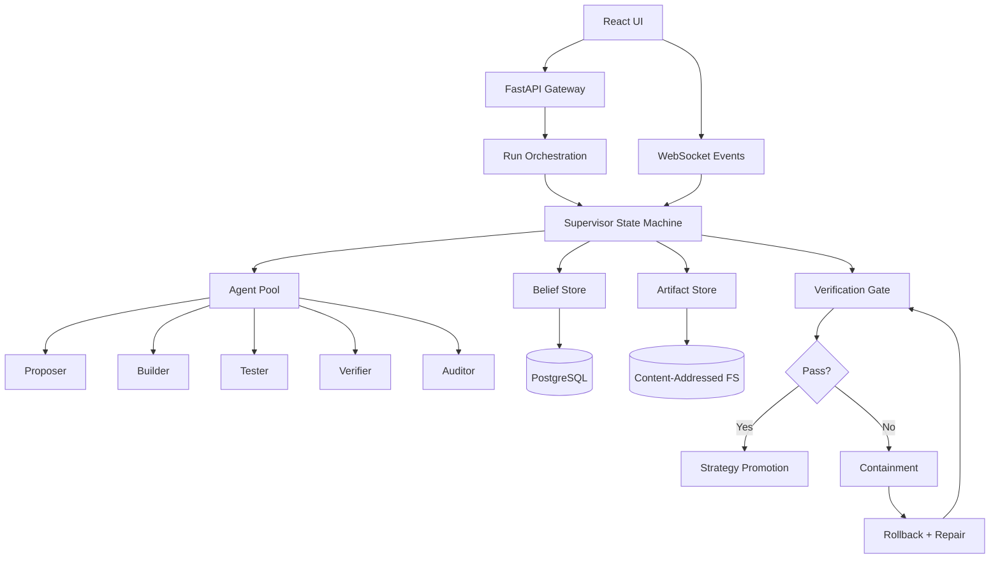

# IRONROOT

An engineering system for evolving agent strategies with hard evidence, auditability, and deterministic replay. Agents earn survival by producing verifiable work. Failures have irreversible consequences.


| Category | Tech | Purpose |
|----------|------|---------|
| Runtime | Python 3.12+ | Type hints, modern syntax |
| API | FastAPI | Async endpoints, OpenAPI spec |
| Database | PostgreSQL | Metadata, run registry, beliefs |
| Queue | Redis + Celery | Background task execution |
| Frontend | React + Vite | Evidence-wired UI |
| Quality | ruff + black + mypy | Zero tolerance for slop |

---

## System Architecture



---

## Core Logic

### Orchestration

| Feature | File | What It Does |
|---------|------|--------------|
| State Machine | [`orchestration/supervisor.py`](src/ironroot/orchestration/supervisor.py) | Explicit phases: init → propose → build → test → verify → audit → decide |
| Budget Enforcement | [`orchestration/budgets.py`](src/ironroot/orchestration/budgets.py) | Hard limits on steps, tool calls, memory writes. Exhaustion halts the run. |
| Kill Switch | [`orchestration/kill_switch.py`](src/ironroot/orchestration/kill_switch.py) | Any invariant break triggers containment |
| Run Service | [`orchestration/run_service.py`](src/ironroot/orchestration/run_service.py) | CRUD for runs with budget tracking |
| Self-Healing | [`orchestration/healing.py`](src/ironroot/orchestration/healing.py) | Containment, rollback, repair flow |

### Storage

| Feature | File | What It Does |
|---------|------|--------------|
| Artifact Hashing | [`storage/artifacts.py`](src/ironroot/storage/artifacts.py) | SHA256 content addressing, write-once enforcement |
| Artifact Service | [`storage/artifact_service.py`](src/ironroot/storage/artifact_service.py) | Store/retrieve with integrity verification |
| Models | [`storage/models.py`](src/ironroot/storage/models.py) | SQLAlchemy ORM for runs, beliefs, agents, incidents, gates |

### Cognition

| Feature | File | What It Does |
|---------|------|--------------|
| Append-Only Beliefs | [`cognition/memory/append_only_store.py`](src/ironroot/cognition/memory/append_only_store.py) | Immutable records with hash chain |
| Belief Service | [`cognition/memory/belief_service.py`](src/ironroot/cognition/memory/belief_service.py) | DB persistence, chain verification |
| Contradiction Detection | [`cognition/memory/contradiction.py`](src/ironroot/cognition/memory/contradiction.py) | Links conflicting beliefs, never modifies |
| Strategy Mutation | [`cognition/strategies/mutation.py`](src/ironroot/cognition/strategies/mutation.py) | Bounded changes with provenance tracking |
| Strategy Service | [`cognition/strategies/strategy_service.py`](src/ironroot/cognition/strategies/strategy_service.py) | Gate-blocked promotion |

### Verification

| Feature | File | What It Does |
|---------|------|--------------|
| Gate Service | [`verification/gate_service.py`](src/ironroot/verification/gate_service.py) | Executes replay, integrity, invariant, regression gates |
| Replay Determinism | [`verification/replay.py`](src/ironroot/verification/replay.py) | Same inputs + seed = equivalent trace digest |
| Regression Gate | [`verification/regression_gate.py`](src/ironroot/verification/regression_gate.py) | All gates must pass for promotion |
| Integrity | [`verification/integrity.py`](src/ironroot/verification/integrity.py) | Stored bytes hash equals recorded hash |

### Agents

| Role | File | Scope |
|------|------|-------|
| Base | [`agents/base.py`](src/ironroot/agents/base.py) | Budgets, penalties, tool access |
| Proposer | [`agents/proposer.py`](src/ironroot/agents/proposer.py) | Proposes cognitive layer changes |
| Builder | [`agents/builder.py`](src/ironroot/agents/builder.py) | Implements under stable contracts |
| Tester | [`agents/tester.py`](src/ironroot/agents/tester.py) | Writes tests against claims |
| Verifier | [`agents/verifier.py`](src/ironroot/agents/verifier.py) | Attempts falsification |
| Auditor | [`agents/auditor.py`](src/ironroot/agents/auditor.py) | Trace integrity, policy compliance |
| Repair | [`agents/repair.py`](src/ironroot/agents/repair.py) | Minimal diff + mandatory new test |

---

## Installation

```bash
# clone
git clone https://github.com/moonrunnerkc/ironroot.git && cd ironroot

# venv with python 3.12+
python3.12 -m venv .venv && source .venv/bin/activate

# install with dev deps (pytest, ruff, black, mypy)
pip install -e ".[dev]"

# copy env template
cp .env.example .env

# start postgres + redis
./scripts/dev_up.sh

# run migrations
alembic upgrade head

# verify: 140 tests, 50%+ coverage
pytest -q --cov=src/ironroot --cov-fail-under=50

# start api
./scripts/run_once.sh
```

---

## Skeptic's Corner

<details>
<summary><strong>Why append-only beliefs instead of mutable state?</strong></summary>

Mutable state hides history. The [`append_only_store.py`](src/ironroot/cognition/memory/append_only_store.py) enforces immutability at DB and API layers. Contradictions are new events, not updates. Hash chains make drift detection trivial: break the chain, break the invariant.

</details>

<details>
<summary><strong>Why content-addressed artifacts?</strong></summary>

UUIDs require trust in the registry. SHA256 requires trust in math. The [`artifacts.py`](src/ironroot/storage/artifacts.py) store uses hash paths. Write-once means same content = same path. Integrity check is O(1): hash bytes, compare to path.

</details>

<details>
<summary><strong>Why explicit state machines?</strong></summary>

Implicit flow hides control. The [`supervisor.py`](src/ironroot/orchestration/supervisor.py) makes every transition explicit with entry/exit conditions. Kill switch can halt at any transition. Replay is deterministic: same inputs, same path.

</details>

<details>
<summary><strong>Why adversarial verification?</strong></summary>

Self-grading is a conflict of interest. The [`verifier.py`](src/ironroot/agents/verifier.py) attempts falsification. The [`auditor.py`](src/ironroot/agents/auditor.py) checks trace integrity. Neither has stake in proposals succeeding. The [`regression_gate.py`](src/ironroot/verification/regression_gate.py) enforces this: no promotion without passing adversarial tests.

</details>

<details>
<summary><strong>Why irreversible penalties?</strong></summary>

Resets teach agents that failure is free. The [`budgets.py`](src/ironroot/orchestration/budgets.py) tracks lifetime budgets that decrease on failure. Tool revocations and task restrictions never reset. This selects for calibrated agents. Overconfident agents burn budgets and die.

</details>

---

## API

Base: `/api/v1`

| Endpoint | Method | Purpose |
|----------|--------|---------|
| `/health` | GET | DB, queue, store connectivity |
| `/runs` | POST | Create run with seed, budgets, gates |
| `/runs/{id}/start` | POST | Start orchestration |
| `/runs/{id}` | GET | Status, phase, budgets, failures |
| `/runs/{id}/stop` | POST | Hard stop, freeze commits |
| `/runs/{id}/gates/execute` | POST | Execute gate suite |
| `/runs/{id}/gates/status` | GET | Pass/fail with artifact evidence |
| `/artifacts/{id}` | GET | Metadata + download |
| `/beliefs` | GET | List with filters |
| `/strategies` | GET/POST | List or register |
| `/strategies/{id}/promote` | POST | Promote if gate passed |

---

## Testing

```bash
pytest tests/unit -v              # unit tests
pytest tests/integration -v       # needs postgres/redis
pytest tests/e2e -v               # full research cycle
pytest --cov=src/ironroot         # coverage report
```

---

## License

MIT
